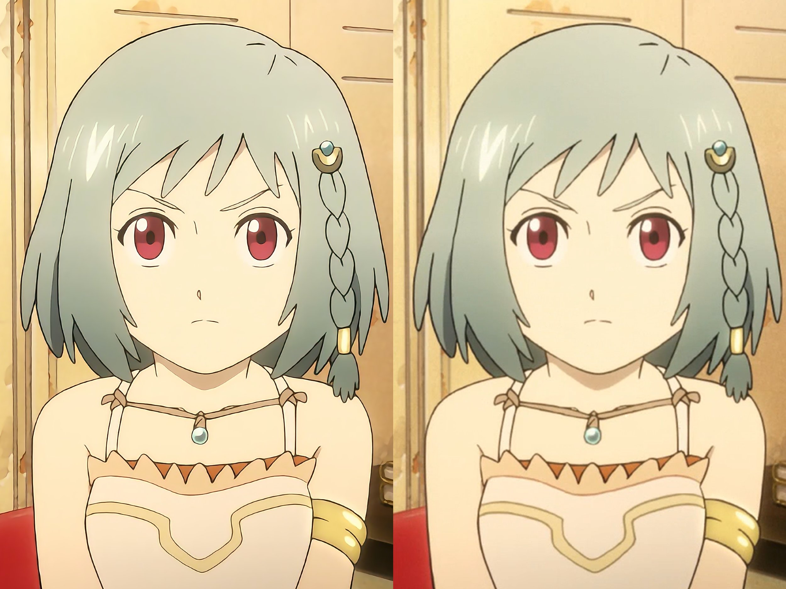

copy from: [Anime4K](https://github.com/bloc97/Anime4K/releases)  [GLSL_Instructions_Windows_MPV](https://github.com/bloc97/Anime4K/blob/master/md/GLSL_Instructions_Windows_MPV.md) [input.conf](https://github.com/bloc97/Anime4K/blob/master/md/Template/GLSL_Windows_High-end/input.conf)

<div style="display: flex;">
  
</div>

## install


- Download the latest version of [anime4k.js](https://github.com/mpv-easy/mpv-easy/releases) and copy it to the mpv script directory

- Add configuration to input.conf [shortkey](https://github.com/mpv-easy/mpv-easy/tree/main/mpv-anime4k#shortkey)

## shortkey

Add config to `input.conf`

```shell
CTRL+0    script-message Anime4K-Clear
CTRL+1    script-message Anime4K-AA-HQ
CTRL+2    script-message Anime4K-B-HQ
CTRL+3    script-message Anime4K-C-HQ
CTRL+4    script-message Anime4K-A-HQ
CTRL+5    script-message Anime4K-BB-HQ
CTRL+6    script-message Anime4K-CA-HQ
```