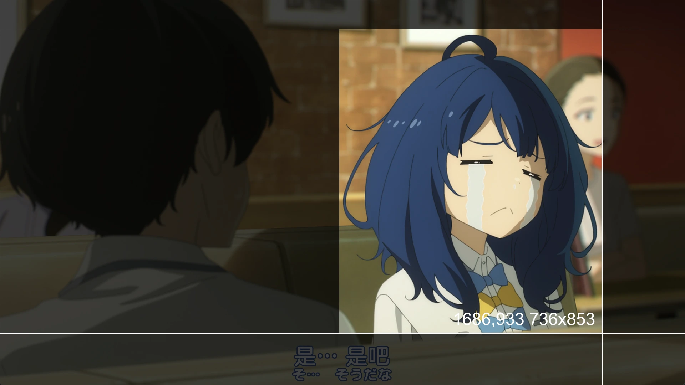

crop script for mpv

In order to preserve the filters added by the user, first use the mpv command `screenshot-to-file` to capture the video screen, and then use ffmpeg to crop it

## install

You need to install [ffmpeg](https://www.ffmpeg.org/download.html) and add ffmpeg to ```PATH```

- Download the latest version of [mpv-crop.js](https://github.com/mpv-easy/mpv-easy/releases) and copy it to the mpv script directory, or use [mpsm](../mpv-mpsm/readme.md) `mpsm install mpv-crop`

- Add configuration to input.conf [shortkey](https://github.com/mpv-easy/mpv-easy/tree/main/mpv-crop#shortkey)


## usage

By default, the shortcut key `C` adds the current time point to the segment, `esc` cancels the selection, and `o` exports the video.

If the video file is `/a/b/c.mp4`, the output image file is `/a/b/c.time.x.y.w.h.webp`. If no output directory is configured, it will be saved to the user's desktop

### mpv-crop

<div style="display: flex;">
  
</div>

### mpv-easy

Use mpv-cut to select the video segment, and then use mpv-crop to crop it.


## shortkey

Add configuration to input.conf

```
C         script-message crop
o         script-message output
ESC       script-message cancel
```

## config

config file: `mpv-crop.conf`


```conf
crop-event-name="crop"
output-event-name="output"
cancel-event-name="cancel"
line-color="00FF00"
mask-color="00FF00"
line-width=2
output-directory=""
crop-image-format="webp"
```