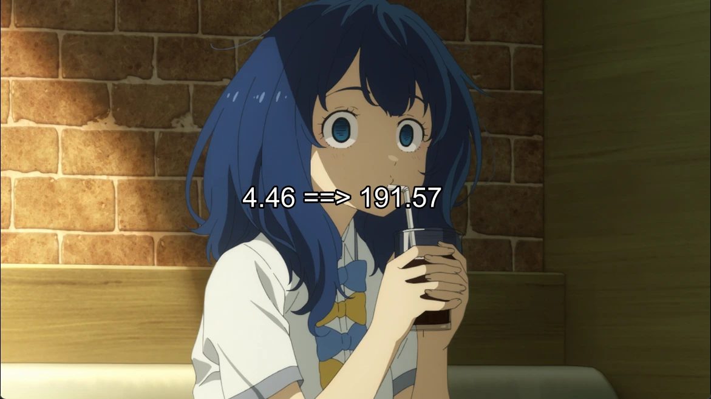
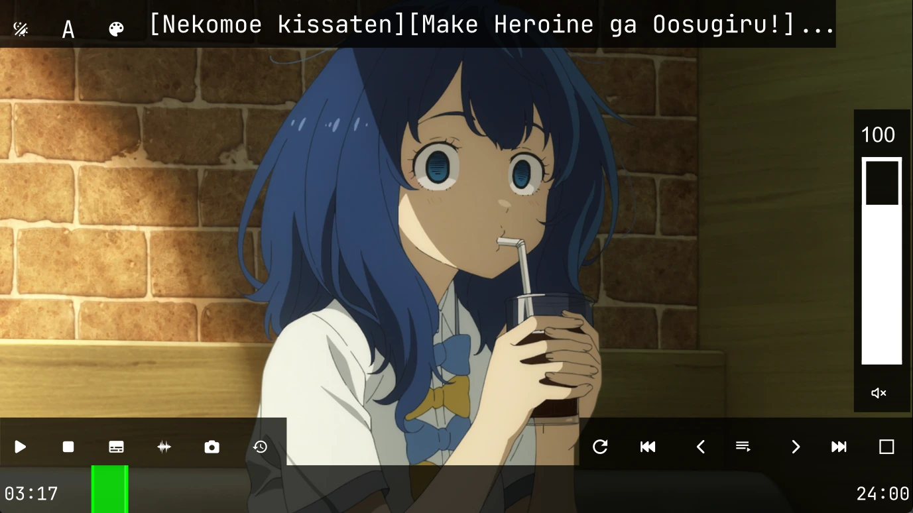

cut videos script for mpv

## install

You need to install [ffmpeg](https://www.ffmpeg.org/download.html) and add ffmpeg to ```PATH```

- Download the latest version of [cut.js](https://github.com/mpv-easy/mpv-easy/releases) and copy it to the mpv script directory

- Add configuration to input.conf [shortkey](https://github.com/mpv-easy/mpv-easy/tree/main/mpv-cut#shortkey)


## usage

By default, the shortcut key `c` adds the current time point to the segment, `esc` cancels the selection, and `o` exports the video.

If the video file is `/a/b/c.mp4`, the output video file is `/a/b/c.start.end.x.y.w.h.mp4`

### cut

cut will display the currently selected video segment in the video

<div style="display: flex;">
  
</div>

### mpv-easy

When the mouse is in the progress bar area, add the current mouse position to the segment, otherwise add the current time to the segmen, progress bar uses green to display the selected area by default

<div style="display: flex;">
  
</div>


## shortkey


Add configuration to input.conf

```
c         script-message cut
o         script-message output
ESC       script-message cancel
```

## config

config file: `cut.conf`
```conf
cut-event-name="cut"
output-event-name="output"
cancel-event-name="cancel"
output-directory=""
```

## todo

- support remote video