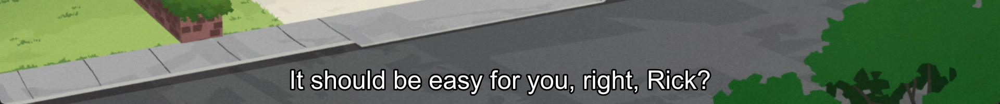
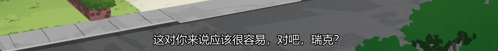
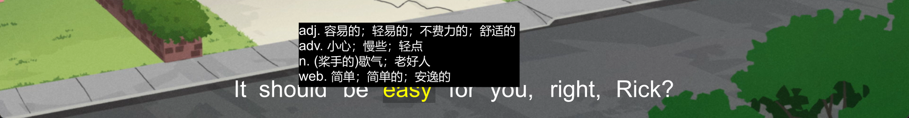
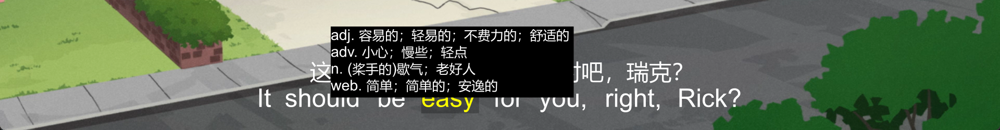

## install
You need to install [ffmpeg](https://www.ffmpeg.org/download.html) and curl and add them to ```PATH```, curl is usually installed by default on all systems including windows11, if you only use interactive translation, you don't need to install ffmpeg

- Download the latest version of [mpv-translate.js](https://github.com/mpv-easy/mpv-easy/releases) and copy it to the mpv script directory, or use [mpsm](../mpv-mpsm/readme.md) `mpsm install mpv-translate`
- Add shortcut keys  ```ctrl+t    script-message translate``` and  ```ctrl+i    script-message interactive-translate``` to your ```input.conf```
- If everything goes well, you can use ```ctrl+t``` to start global translation (requires ffmpeg and curl and only supports local videos), ```ctrl+i``` to start interactive translation (requires curl)
- You can customize the styles of subtitles and tooltips, see [mpv-translate.conf](./mpv-translate.conf)

## support language

https://cloud.google.com/translate/docs/languages


## config

```json
{
  "sourceLang": "en-US",
  "targetLang": "zh-CN",
}
```

## short key

| key    | command                              |
| ------ | ------------------------------------ |
| ctrl+t | script-message translate             |
| ctrl+T | script-message mix-translate         |
| ctrl+i | script-message interactive-translate |

## translate (ctrl+t)

Default subtitle is English

<div style="display: flex;">
  
</div>

Translate to Chinese

<div style="display: flex;">
  
</div>


## mix-translate (ctrl+shif+t or ctrl+T)

Display Chinese and English

<div style="display: flex;">
  
</div>

## interactive-translate (ctrl+i)

Click left mouse button to play the audio, and click the wheel to display the full sentence translation
<div style="display: flex;">
  
</div>

## mix-translate and interactive-translate  (ctrl+T then ctrl+i)

Mix translation and interactive translation can be used at the same time

<div style="display: flex;">
  
</div>


## todo
- auto detect source language
- remove ffmpeg dependency
- support more languages
- support ass
- support bing, deepl