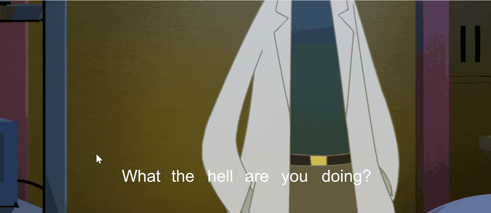

## install
Need to install ffmpeg first


## support language

https://cloud.google.com/translate/docs/languages


## config

```json
{
  "sourceLang": "en-US",
  "targetLang": "zh-CN",
}
```


## translate (ctrl+t)

<div style="display: flex;">
  
</div>

## interactive-translate (ctrl+i)

Click left mouse button to play the audio, and click the wheel to display the full sentence translation
<div style="display: flex;">
  
</div>


## todo
- remove ffmpeg dependency
- support more languages
- support ass
- support bing, deepl