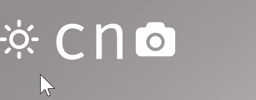

## mpv-easy
TS and React toolkit for mpv script


## install
Download latest release zip file and extract all to the mpv scripts directory, for example:

```txt
portable_config
├── fonts
│   └── FiraCodeNerdFontMono-Regular.ttf
├── scripts
│   ├── mpv-easy.js
└── shaders
    ├── *.glsl
```


## dev
bash
```bash
export MPV_SCRIPT_DIR=/your_mpv_dir/portable_config/scripts && pnpm run dev
```

fish
```fish
set -x MPV_SCRIPT_DIR /your_mpv_dir/portable_config/scripts ; pnpm run dev
```

## example
### drag-ball


### snake


### i18n


### counter-ui


## config

### mouseHoverStyle
Only supports Windows, requires installation of PowerShell to enable script execution permissions
```powershell
set-executionpolicy remotesigned
```


### toolbar



## quick start
[mpv-easy-demo](https://github.com/ahaoboy/mpv-easy-demo)

[more example](./mpv-easy/src/example/)

## Q&A
### mujs stack overflow
If your code throw a stack overflow error with mujs, you need to use the babel plugin [hack.js](./mpv-easy/src//babel//hack.js)
. It adds a function variable at the beginning of all functions to expand the stack size. Alternatively, you can use a custom compiled version of mujs and mpv, change mujs JS_STACKSIZE
```diff
- #define JS_STACKSIZE 256	/* value stack size */

+ #define JS_STACKSIZE 1024	/* value stack size */
```

## todo
- [ ] flex (30%)
- [ ] grid
- [ ] logo
- [ ] bilibili
- [ ] youtube
- [ ] animation
- [ ] es2022
- [ ] test
- [ ] mpv prop type
- [ ] plugin system
- [ ] menu system
- [ ] CI snapshot test
- [ ] font rem
- [ ] sourcemap
- [ ] node console
- [ ] es/cjs plugin module
- [ ] real-time subtitle translation
- [ ] sourcemap