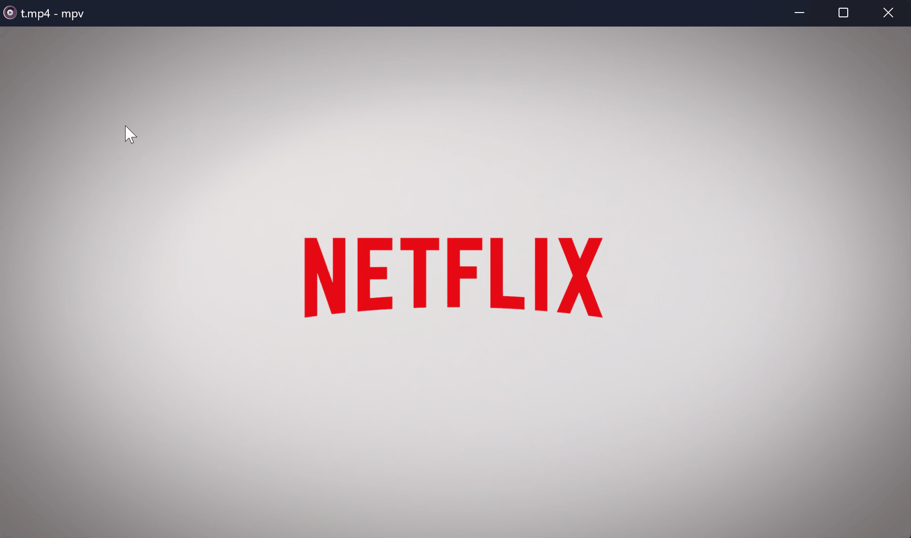
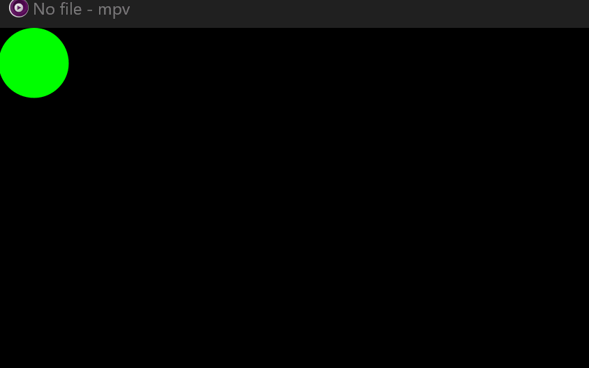
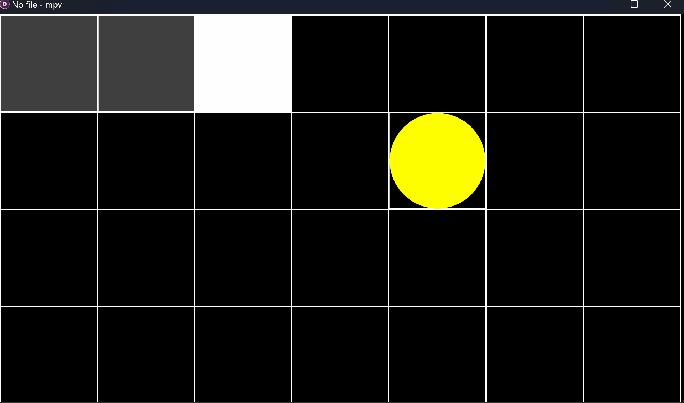
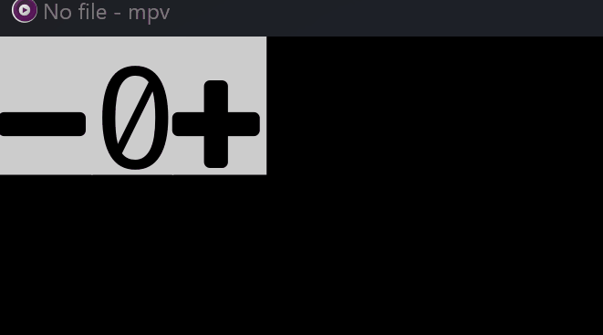
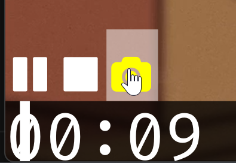

## mpv-easy

TS and React toolkit for mpv script


## install

[install](./mpv-easy-react/install.md)

## CONTRIBUTING

[CONTRIBUTING](./mpv-easy-react/CONTRIBUTING.md)

## dev

bash

```bash
export MPV_SCRIPT_DIR=/your_mpv_dir/portable_config/scripts && pnpm run dev
```

fish

```fish
set -x MPV_SCRIPT_DIR /your_mpv_dir/portable_config/scripts ; pnpm run dev
```

## plugin

- [mpv-anime4k](./mpv-anime4k/readme.md)
- [mpv-autoload](./mpv-autoload/readme.md)
- [mpv-clipboard-play](./mpv-clipboard-play/readme.md)
- [mpv-copy-screen](./mpv-copy-screen/readme.md)
- [mpv-copy-time](./mpv-copy-time/readme.md)
- [mpv-thumbfast](./mpv-thumbfast/readme.md)
- [mpv-play-with](./mpv-play-with/readme.md)
- [mpv-translate](./mpv-translate/readme.md)
- [mpv-cut](./mpv-cut/readme.md)
- [mpv-crop](./mpv-crop/readme.md)

## short key

| key       | command                              |
| --------- | ------------------------------------ |
| ENTER     | cycle fullscreen                     |
| [         | script-message change-speed -0.25    |
| ]         | script-message change-speed +0.25    |
| c         | script-message cut                   |
| C         | script-message crop                  |
| o         | script-message output                |
| ESC       | script-message cancel                |
| UP        | script-message change-volume +10     |
| DOWN      | script-message change-volume -10     |
| ctrl+UP   | script-message change-fontSize +0.25 |
| ctrl+DOWN | script-message change-fontSize -0.25 |
| ctrl+o    | script-message open-dialog           |
| ctrl+t    | script-message translate             |
| ctrl+i    | script-message interactive-translate |
| ctrl+T    | script-message mix-translate         |
| CTRL+0    | script-message Anime4K-Clear         |
| CTRL+1    | script-message Anime4K-AA-HQ         |
| CTRL+2    | script-message Anime4K-B-HQ          |
| CTRL+3    | script-message Anime4K-C-HQ          |
| CTRL+4    | script-message Anime4K-A-HQ          |
| CTRL+5    | script-message Anime4K-BB-HQ         |
| CTRL+6    | script-message Anime4K-CA-HQ         |
| CTRL+v    | script-message clipboard-play        |
| CTRL+c    | script-message copy-screen           |
| CTRL+C    | script-message copy-time             |

## UI

### uosc

<div style="display: flex;">
  
  
</div>

### osc

<div style="display: flex;">
  
  
</div>

### oscx

<div style="display: flex;">
  
  
</div>

## example

### drag-ball



### snake



### i18n


### counter-ui



## config

### mouseHoverStyle

Only supports Windows, requires installation of PowerShell to enable script execution permissions

```powershell
set-executionpolicy remotesigned
```



## quick start

[mpv-easy-demo](https://github.com/ahaoboy/mpv-easy-demo)

[more example](./mpv-easy-react/src/example/)

[mpv-easy-tpl](https://github.com/mpv-easy/mpv-easy-tpl)

## Q&A

### mujs stack overflow

If your code throw a stack overflow error with mujs, you need to use the babel plugin [hack.js](./mpv-easy-react/src//babel//hack.js)
. It adds a function variable at the beginning of all functions to expand the stack size. Alternatively, you can use a custom compiled version of mujs and mpv, change mujs JS_STACKSIZE

fixed: [Increase default stack sizes.](https://github.com/ccxvii/mujs/commit/7e27931468a7c0f41b2c8a64c9cb6b069f47a5ac)

```diff
- #define JS_STACKSIZE 256	/* value stack size */

+ #define JS_STACKSIZE 1024	/* value stack size */
```

## perf

Maybe should use GitHub action to automatically update this

| js engine   | first render | average | js file size |
| ----------- | :----------: | ------: | -----------: |
| qjs         |    358ms     |  3.58ms |         1.4M |
| qjs+minify  |    334ms     |  3.42ms |         300K |
| mujs+es5    |    402 ms    | 14.05ms |         1.1M |
| deno        |    291 ms    |  0.23ms |         1.4M |
| deno+minify |    464 ms    |  0.23ms |         306K |
| boa+es6     |    400 ms    | 21.88ms |         1.2M |

## changlog

- [0.1.12](./assets/changelog/0.1.12.md)

## todo

- [ ] flex (30%)
- [ ] grid
- [ ] logo
- [ ] bilibili
- [ ] youtube
- [ ] animation
- [ ] es2022
- [ ] test
- [ ] mpv prop type
- [ ] plugin system
- [ ] menu system
- [ ] CI snapshot test
- [ ] font rem
- [ ] node console
- [ ] es/cjs plugin module
- [ ] real-time subtitle translation
- [ ] sourcemap


